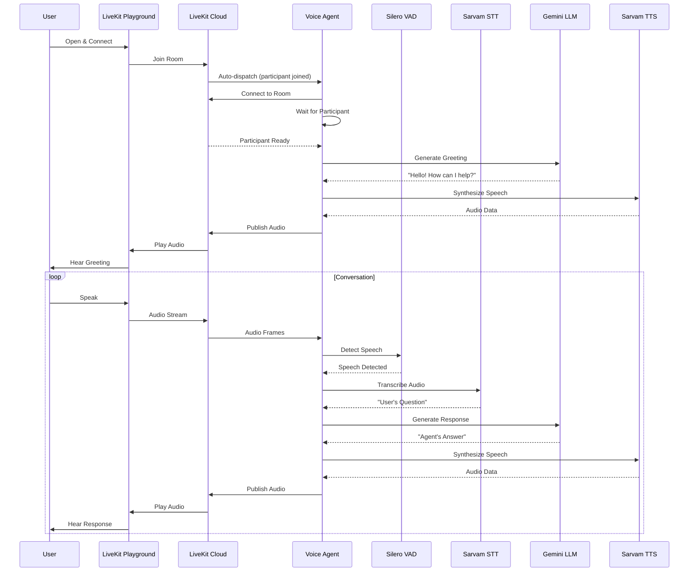
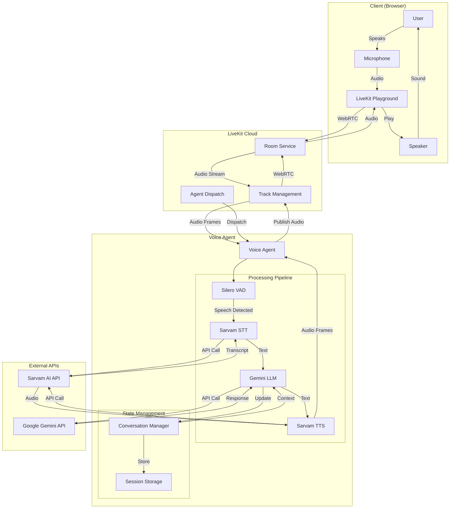

# Conversation AI - Voice Agent

A multi-turn conversational AI chatbot using a real-time STT-LLM-TTS pipeline built with LiveKit Agents, Sarvam AI, and Google Gemini.

## Features

- **Real-time Voice Conversation**: Natural voice interactions with low latency
- **Multi-turn Context**: Maintains conversation history for contextual responses
- **Speech-to-Text (STT)**: Sarvam AI for accurate speech recognition
- **Language Model (LLM)**: Google Gemini 2.5 Flash for intelligent responses
- **Text-to-Speech (TTS)**: Sarvam AI Bulbul v2 for natural voice synthesis
- **Voice Activity Detection**: Silero VAD for accurate speech detection

## Architecture

```
┌─────────────────────────────────────────────────────────────────┐
│                      LiveKit Cloud                               │
│  ┌─────────────┐    ┌─────────────┐    ┌─────────────┐         │
│  │   Room      │◄──►│   Agent     │◄──►│  Dispatch   │         │
│  └─────────────┘    └─────────────┘    └─────────────┘         │
└─────────────────────────────────────────────────────────────────┘
         │                    │
         ▼                    ▼
┌─────────────────────────────────────────────────────────────────┐
│                    Voice Agent Pipeline                          │
│                                                                  │
│  ┌──────────┐    ┌──────────┐    ┌──────────┐    ┌──────────┐  │
│  │  Silero  │───►│  Sarvam  │───►│  Gemini  │───►│  Sarvam  │  │
│  │   VAD    │    │   STT    │    │   LLM    │    │   TTS    │  │
│  └──────────┘    └──────────┘    └──────────┘    └──────────┘  │
│                                                                  │
│  Audio In ──────► Speech ──────► Text ──────► Response ──────►  │
│                  Detection     Recognition    Generation   Audio │
└─────────────────────────────────────────────────────────────────┘
```

## Quick Start

### Prerequisites

- Python 3.11+
- [uv](https://github.com/astral-sh/uv) package manager (recommended) or pip
- API keys for:
  - [Sarvam AI](https://www.sarvam.ai/) (STT/TTS)
  - [Google Gemini](https://ai.google.dev/) (LLM)
  - [LiveKit Cloud](https://cloud.livekit.io/) (Real-time communication)

### Installation

1. **Clone the repository**
   ```bash
   git clone https://github.com/AnupCloud/conversational_ai.git
   cd conversation_ai
   ```

2. **Install dependencies**

   Using uv (recommended):
   ```bash
   uv sync
   ```

   Or using pip:
   ```bash
   python -m venv .venv
   source .venv/bin/activate  # On Windows: .venv\Scripts\activate
   pip install -r requirements.txt
   ```

3. **Configure environment**
   ```bash
   cp .env.example .env
   # Edit .env with your API keys
   ```

### Run the Agent

#### Option 1: Using run.sh (Recommended)

**Single command to start:**
```bash
./run.sh
```

This will:
1. Validate your configuration
2. Generate an access token
3. Start the voice agent (auto-dispatch mode)
4. Display connection instructions

#### Option 2: Manual Execution

If you prefer not to use `run.sh`, you can run the agent manually:

**Step 1: Generate an access token**

Using uv:
```bash
uv run python generate_token.py test-room user-test
```

Or using pip (with virtual environment activated):
```bash
python generate_token.py test-room user-test
```

This will output an access token. Copy it for use in the LiveKit Playground.

**Step 2: Start the agent**

Using uv:
```bash
uv run python main.py dev
```

Or using pip (with virtual environment activated):
```bash
python main.py dev
```

**Note:** Make sure your `.env` file is properly configured with all required API keys before running manually.

### Connect via LiveKit Playground

1. Open **[LiveKit Agents Playground](https://agents-playground.livekit.io/)**
2. Enter the **LiveKit URL** shown in the terminal
3. Paste the **Access Token** shown in the terminal
4. Click **Connect**
5. Allow microphone access and start talking!

## Project Structure

```
conversation_ai/
├── main.py                 # Application entry point
├── run.sh                  # Start script with token generation
├── generate_token.py       # Token generation utility
├── pyproject.toml          # Project configuration (uv)
├── requirements.txt        # Dependencies (pip)
├── .env.example            # Environment template
├── Dockerfile              # Container configuration
└── src/
    └── conversation_ai/
        ├── agents/
        │   └── voice_agent.py    # Main voice agent
        ├── config/
        │   └── settings.py       # Configuration management
        ├── conversation/
        │   └── manager.py        # Conversation state management
        ├── llm/
        │   └── gemini_llm.py     # Gemini LLM integration
        ├── stt/
        │   └── sarvam_stt.py     # Sarvam STT integration
        └── tts/
            └── sarvam_tts.py     # Sarvam TTS integration
```

## Configuration

### Environment Variables

| Variable | Description | Required |
|----------|-------------|----------|
| `SARVAM_API_KEY` | Sarvam AI API key | Yes |
| `GEMINI_API_KEY` | Google Gemini API key | Yes |
| `LIVEKIT_URL` | LiveKit server URL | Yes |
| `LIVEKIT_API_KEY` | LiveKit API key | Yes |
| `LIVEKIT_API_SECRET` | LiveKit API secret | Yes |
| `GEMINI_MODEL` | Gemini model name | No (default: gemini-2.5-flash) |
| `SARVAM_TTS_SPEAKER` | TTS voice | No (default: anushka) |
| `SARVAM_TTS_LANGUAGE` | TTS language | No (default: en-IN) |
| `LOG_LEVEL` | Logging level | No (default: INFO) |

### Supported Languages

The agent supports multiple Indian languages through Sarvam AI:
- English (en-IN)
- Hindi (hi-IN)
- Tamil (ta-IN)
- Telugu (te-IN)
- And more...

### Available TTS Voices

- anushka (female)
- hitesh (male)

## Docker

### Build the image
```bash
docker build -t conversation-ai .
```

### Run the container
```bash
docker run --env-file .env conversation-ai
```

## Sequence Diagram



## Architecture Workflow



## Troubleshooting

### Agent not responding to voice
- Ensure microphone permissions are granted in the browser
- Check that VAD is detecting speech (look for "speech started" in logs)
- Verify Sarvam API key is valid

### No audio output
- Check TTS logs for errors
- Verify audio output is enabled in the playground

### Token expired
- Generate a new token using `./run.sh`
- Tokens are valid for 1 hour by default

## License

MIT License

## Acknowledgments

- [LiveKit](https://livekit.io/) - Real-time communication platform
- [Sarvam AI](https://www.sarvam.ai/) - Indian language AI APIs
- [Google Gemini](https://ai.google.dev/) - Large language model
